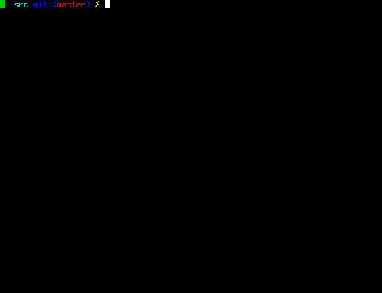

ZiCE 2.0.6

===========

What is ZiCE?
--------------

[ZiCE](https://z.cash/) is an implementation of the "Zerocash" protocol.
Based on Bitcoin's code, it intends to offer a far higher standard of privacy
through a sophisticated zero-knowledge proving scheme that preserves
confidentiality of transaction metadata. Technical details are available
in our [Protocol Specification](https://github.com/zice/zips/raw/master/protocol/protocol.pdf).

This software is the ZiCE client. It downloads and stores the entire history
of ZiCE transactions; depending on the speed of your computer and network
connection, the synchronization process could take a day or more once the
blockchain has reached a significant size.

<p align="center">
  
</p>

#### :lock: Security Warnings

See important security warnings on the
[Security Information page](https://z.cash/support/security/).

**ZiCE is experimental and a work-in-progress.** Use at your own risk.

####  :ledger: Deprecation Policy

This release is considered deprecated 16 weeks after the release day. There
is an automatic deprecation shutdown feature which will halt the node some
time after this 16 week time period. The automatic feature is based on block
height.

## Getting Started

Please see our [user guide](https://zice.readthedocs.io/en/latest/rtd_pages/rtd_docs/user_guide.html) for joining the main ZiCE network.

### Need Help?

* :blue_book: See the documentation at the [ReadtheDocs](https://zice.readthedocs.io)
  for help and more information.
* :incoming_envelope: Ask for help on the [ZiCE](https://forum.z.cash/) forum.
* :mag: Chat with our support community on [Rocket.Chat](https://chat.zicecommunity.com/channel/user-support)

Participation in the ZiCE project is subject to a
[Code of Conduct](code_of_conduct.md).

### Building

Build ZiCE along with most dependencies from source by running:

```
./zcutil/build.sh -j$(nproc)
```

Currently only Linux is officially supported.

License
-------

For license information see the file [COPYING](COPYING).
